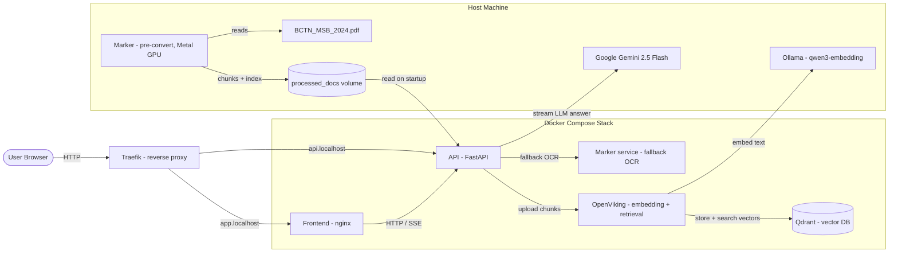
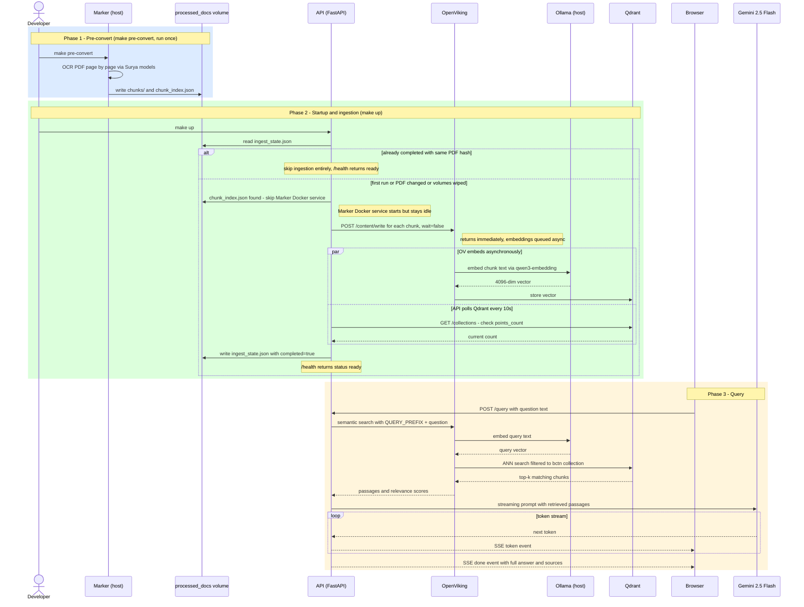

# AIT Homework — RAG Q&A over MSB Annual Report 2024

A Retrieval-Augmented Generation (RAG) system that answers questions about the BCTN MSB 2024 annual report in Vietnamese. The user types a question; the system retrieves relevant passages from the PDF, then streams a grounded answer via Gemini 2.5 Flash.

---

## Architecture



| Service | Image | Role | Docs |
|---|---|---|---|
| `traefik` | `traefik:v3` | Reverse proxy — routes `*.localhost` hostnames | [traefik.md](docs/services/traefik.md) |
| `frontend` | built from `frontend/` | Static HTML/JS chat UI served by nginx | [frontend.md](docs/services/frontend.md) |
| `api` | built from `services/api/` | FastAPI: ingestion, retrieval, streaming Q&A | [api.md](docs/services/api.md) |
| `openviking` | built from `openviking/` | Embedding upload + semantic retrieval | [openviking.md](docs/services/openviking.md) |
| `qdrant` | `qdrant/qdrant:latest` | Vector database | [qdrant.md](docs/services/qdrant.md) |
| `marker` | built from `services/marker/` | PDF OCR via marker-pdf | [marker.md](docs/services/marker.md) |

---

## End-to-End Flow



---

## Prerequisites

| Tool | Version | Purpose |
|---|---|---|
| Docker Desktop | ≥ 4.30 | Runs all services |
| `uv` | ≥ 0.4 | Python workspace manager |
| Ollama | ≥ 0.3 | Serves `qwen3-embedding` on host |
| A Google API key | — | Enables Gemini 2.5 Flash |

Install `qwen3-embedding` before first run:

```bash
ollama pull qwen3:embedding
```

---

## Quick Start

```bash
# 1. Clone and enter the project
git clone <repo-url> && cd ait-homework

# 2. Install Python workspace dependencies (for local tooling and type checking)
make dev

# 3. Configure environment
cp .env.example .env
# Edit .env — set GOOGLE_API_KEY

# 4. Generate openviking/ov.conf from the template
make setup

# 5. OCR the PDF on the host (uses Metal GPU; takes ~2.5 hours for full document)
make pre-convert

# 6. Start all Docker services
make up

# 7. Run a smoke-test query
make test
```

Once running, open **http://app.localhost** in your browser.

---

## URLs (local)

| URL | Service |
|---|---|
| http://app.localhost | Chat UI |
| http://api.localhost/health | API health + ingestion status |
| http://api.localhost/docs | FastAPI interactive docs |
| http://openviking.localhost | OpenViking dashboard |
| http://qdrant.localhost | Qdrant REST API |
| http://localhost:8080 | Traefik dashboard |

---

## Make Targets

```
make dev           Install all workspace dependencies into .venv
make setup         Generate openviking/ov.conf from template
make pre-convert   OCR the PDF on host (full GPU + RAM)
make up            Start all services (detached)
make down          Stop services, keep volumes
make clean         Stop services and wipe all volumes (fresh start)
make build         Rebuild Docker images
make logs          Follow all service logs
make logs-api      Follow a specific service's logs
make test          Run smoke-test query against the running stack
make demo-prep     Generate demo_data.json from the live API
make fix-summaries Translate OpenViking L0/L1 summaries to English
```

---

## Configuration

All variables are read from the environment (or `.env`):

| Variable | Default | Description |
|---|---|---|
| `GOOGLE_API_KEY` | — | Gemini API key; if unset, Ollama is used for chat |
| `CHAT_MODEL` | `gemini-2.5-flash` | LLM model ID |
| `OLLAMA_BASE_URL` | `http://host.docker.internal:11434` | Ollama URL |
| `OLLAMA_VLM_MODEL` | `qwen3:14b` | Ollama model for OpenViking doc summaries |
| `QDRANT_URL` | `http://qdrant:6333` | Qdrant URL (used by API for ingestion polling) |
| `OPENVIKING_URL` | `http://openviking:1933` | OpenViking base URL |
| `OPENVIKING_API_KEY` | `ait-dev` | OpenViking API key |
| `PDF_PATH` | `/data/BCTN_MSB_2024.pdf` | PDF path inside the API container |
| `PROCESSED_DOCS_PATH` | `/processed_docs` | Volume path for chunks and ingestion state |

See [docs/services/api.md](docs/services/api.md) for LLM backend switching details and [docs/services/openviking.md](docs/services/openviking.md) for VLM configuration.

---

## Running Tests

```bash
# API service tests
uv run --project services/api pytest services/api/tests/ -v

# Marker service tests
uv run --project services/marker pytest services/marker/tests/ -v
```

---

## Service Documentation

Detailed architecture, configuration, and operational notes for each service:

| Service | Document |
|---|---|
| Traefik (reverse proxy) | [docs/services/traefik.md](docs/services/traefik.md) |
| Frontend (chat UI) | [docs/services/frontend.md](docs/services/frontend.md) |
| API (FastAPI backend) | [docs/services/api.md](docs/services/api.md) |
| OpenViking (embedding + retrieval) | [docs/services/openviking.md](docs/services/openviking.md) |
| Qdrant (vector database) | [docs/services/qdrant.md](docs/services/qdrant.md) |
| Marker (PDF OCR) | [docs/services/marker.md](docs/services/marker.md) |
